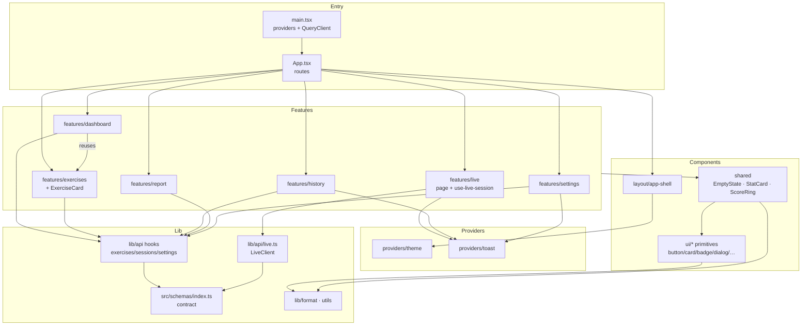
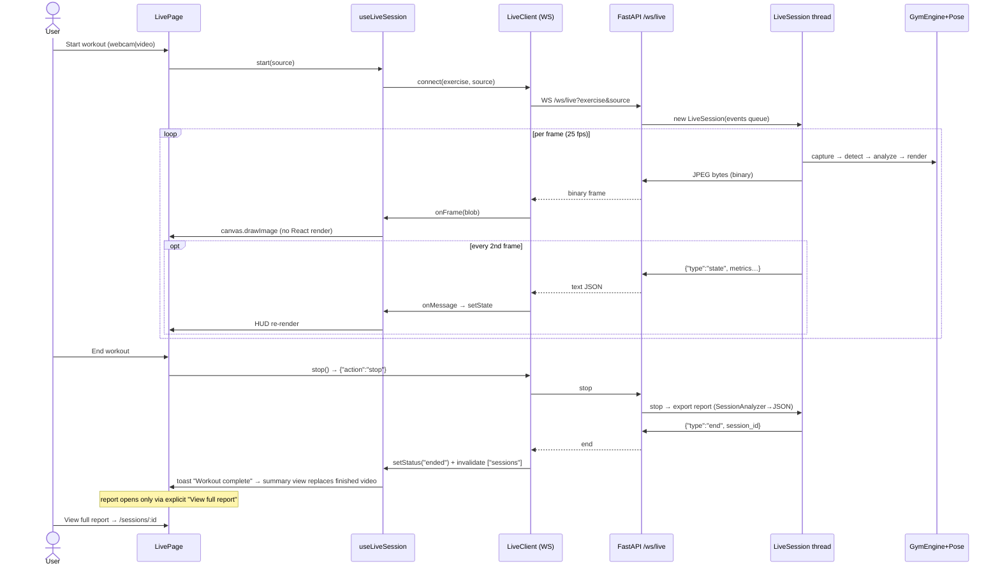
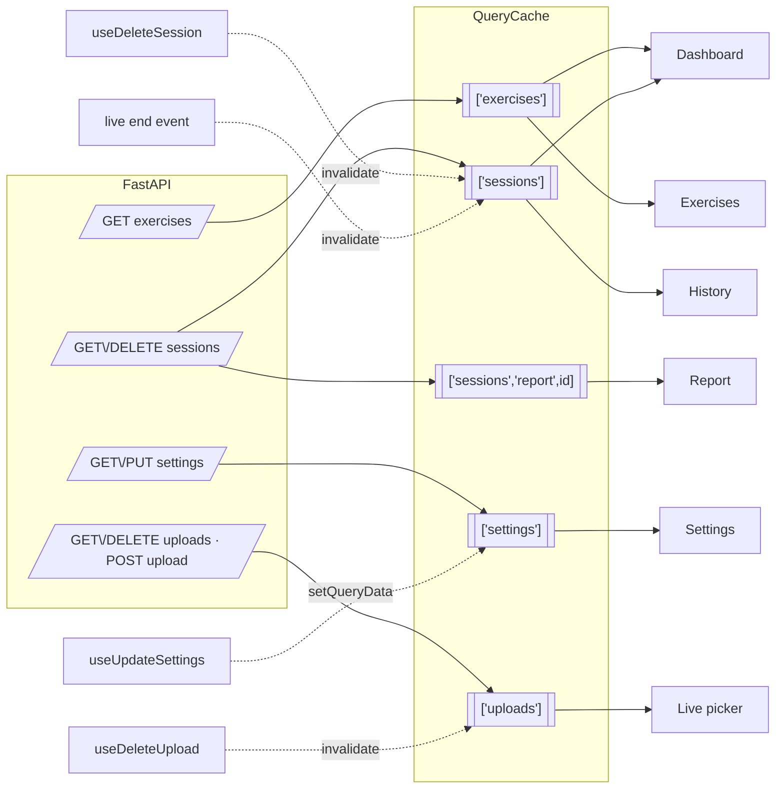

# AI-GYM — Frontend Architecture

> **Single source of truth for the React frontend.**
> Every statement in this document was verified by reading the actual source code
> under `frontend/`. Where something is missing, unfinished, or a deliberate
> placeholder, it is marked **〔unfinished〕** or **〔dead code/quirk〕** — nothing
> here is aspirational documentation.

- **Location:** `frontend/` (this document lives in `docs/` since the docs consolidation)
- **Sources scanned:** 41 authored files, ~3,920 LOC under `src/` (excl. `node_modules`, `dist`)
- **Companion docs:** `docs/ARCHITECTURE.md` (engine), root `README.md` (full-stack overview)
- **Backend contract used herein:** `backend/src/server/**` (FastAPI + WebSocket)

---

## Table of contents

1. [Overall architecture](#1-overall-architecture)
2. [Folder structure](#2-folder-structure)
3. [File responsibilities](#3-file-responsibilities)
4. [Component tree](#4-component-tree)
5. [Routing](#5-routing)
6. [State management](#6-state-management)
7. [Backend communication](#7-backend-communication)
8. [Realtime pipeline](#8-realtime-pipeline)
9. [Dashboard](#9-dashboard)
10. [Charts](#10-charts)
11. [Styling](#11-styling)
12. [Performance](#12-performance)
13. [Error handling](#13-error-handling)
14. [Data models](#14-data-models)
15. [User flow](#15-user-flow)
16. [Design decisions](#16-design-decisions)
17. [Future extension](#17-future-extension)
18. [Mermaid diagrams](#18-mermaid-diagrams)
19. [Final summary](#19-final-summary)

---

## 1. Overall architecture

### What it is

A **single-page application** (React 18 + TypeScript, Vite 6) that acts as the
coaching front-end for the Python BlazePose engine. It has exactly four jobs:

1. **Catalogue** — browse coachable exercises (`/exercises`).
2. **Live coaching** — run a workout (webcam or a user-uploaded clip)
   against the backend engine over one WebSocket and render video + metrics
   in real time (`/live/:exerciseId`), with the report — and optionally a
   rendered video — delivered at the end.
3. **History & reports** — list exported session reports and render a rich
   per-repetition breakdown (`/sessions`, `/sessions/:sessionId`).
4. **Operations** — edit safe runtime settings persisted to `backend/.env`
   (`/settings`), plus a landing dashboard aggregating history (`/`).

### Architectural shape

The codebase is deliberately **layered by dependency direction**, not by file
type:

```
┌────────────────────────────────────────────────────────────────┐
│ features/            pages (dashboard, exercises, live, …)     │  ← knows everything below
├────────────────────────────────────────────────────────────────┤
│ components/          AppShell layout + ui/ primitives + shared │  ← knows lib, ui; NOT features
├────────────────────────────────────────────────────────────────┤
│ providers/           theme + toast contexts                    │  ← knows ui, lib
├────────────────────────────────────────────────────────────────┤
│ schemas/             shared data models (mirror backend)       │  ← knows nothing above
│ lib/api/, lib/       fetch client, WS client, utils            │
│ lib/                 cn(), formatters                          │
└────────────────────────────────────────────────────────────────┘
```

Imports flow **downward only**. `schemas/` never imports a component;
`components/ui/*` never imports a page. This is enforced socially (folder
layout + review), not by a lint rule.

### Design philosophy (as evidenced by the code)

- **Backend is the source of truth.** The UI never invents fields: exercise
  cards render only data the registry exposes (e.g. there is deliberately *no*
  "difficulty" badge because no such backend field exists). `types.ts` mirrors
  the exported session-report JSON verbatim and says so in its header comment.
- **Server state ≠ client state.** Server data lives exclusively in
  **TanStack Query** caches; ephemeral UI state (filters, dialogs, live stream)
  lives in `useState`/refs. There is **no Redux/Zustand** and no need for one
  (see §6, §16).
- **Streaming efficiency over convenience.** Video pixels travel as binary
  WebSocket frames drawn straight to a `<canvas>`, bypassing React's render
  cycle; only throttled JSON metric packets re-render React (see §8).
- **Commercial look, dark-first.** A Tailwind CSS-variable token system
  (athletic lime primary on near-black) inspired by Tempo/Tonal/Whoop-class
  products, with hand-rolled shadcn-style primitives instead of a component
  library dependency.
- **Honest UX.** Every list page has loading skeletons, error states with
  retry, and empty states. Nothing renders raw JSON.

### Technology stack (from `package.json`)

| Layer | Choice | Version |
|---|---|---|
| UI runtime | `react` / `react-dom` | ^18.3.1 (StrictMode on) |
| Language | `typescript` | ^5.7.2, **strict** + `noUnusedLocals` + `noUnusedParameters` |
| Build | `vite` + `@vitejs/plugin-react` | ^6.0.7 / ^4.3.4 |
| Routing | `react-router-dom` | ^6.28.1 |
| Server cache | `@tanstack/react-query` | ^5.62.11 |
| Styling | `tailwindcss` + autoprefixer | ^3.4.17 (class-based dark mode) |
| Charts | `recharts` | ^2.15.0 |
| Animation | `framer-motion` | ^11.15.0 |
| Icons | `lucide-react` | ^0.469.0 |
| Primitives | `@radix-ui/react-dialog` / `-slot` / `-tooltip` | ^1.1.x |
| Class utils | `clsx`, `tailwind-merge`, `class-variance-authority` | ^2.1.1 / ^2.6.0 / ^0.7.1 |

Build gate: `npm run build` = `tsc --noEmit -p tsconfig.json && vite build`
(type-check is a hard gate, not a separate step). Dev proxy: `/api` →
`http://localhost:8000`, `/ws` → `ws://localhost:8000` (`vite.config.ts`), so
app code uses **same-origin relative URLs only** and contains zero CORS/host
logic. Path alias `@/*` → `src/*` is configured identically in `tsconfig.json`
and `vite.config.ts`.

---

## 2. Folder structure

```
frontend/
├── index.html                  entry HTML, ships class="dark" + theme-color
├── package.json                scripts + pinned deps (npm, package-lock.json)
├── vite.config.ts              react plugin, @ alias, dev proxy /api + /ws
│                               (target from frontend/.env VITE_API_TARGET)
├── .env / .env.example         Vite dev-proxy target (frontend-only config)
├── tsconfig.json / tsconfig.node.json
├── tailwind.config.ts          token→Tailwind color mapping, fonts, keyframes
├── postcss.config.js           tailwind + autoprefixer
├── .gitignore                  node_modules, dist, *.local, .DS_Store
└── src/
    ├── main.tsx                bootstrap + provider composition
    ├── App.tsx                 router (layout route + 6 pages + 404)
    ├── index.css               @tailwind + CSS-var design tokens (dark/light)
    ├── vite-env.d.ts           /// <reference types="vite/client" />
    ├── schemas/
    │   └── index.ts            ALL shared data models (mirror backend exactly)
    ├── lib/
    │   ├── utils.ts            cn() (clsx + tailwind-merge)
    │   ├── format.ts           display formatters (date/seconds/score color…)
    │   └── api/
    │       ├── client.ts       fetch wrapper + ApiError + errorDetailMessage
    │       ├── exercises.ts    useExercises() query hook
    │       ├── sessions.ts     useSessions/useSession/useDeleteSession
    │       ├── settings.ts     useSettings/useUpdateSettings
    │       ├── uploads.ts      uploadVideo (XHR) + useUploads/useDeleteUpload
    │       └── live.ts         LiveClient (WebSocket, binary+text frames)
    ├── providers/
    │   ├── theme.tsx           ThemeProvider/useTheme (localStorage)
    │   └── toast.tsx           ToastProvider/useToast (auto-dismiss)
    ├── components/
    │   ├── ui/                 button, card, badge, progress, skeleton,
    │   │                       input, dialog, tooltip   (design primitives)
    │   ├── shared.tsx          EmptyState, StatCard, ScoreRing
    │   └── layout/
    │       └── app-shell.tsx   sidebar (md+) / mobile header / <Outlet/>
    └── features/               one folder per routed page (co-located parts)
        ├── dashboard/page.tsx
        ├── exercises/{page.tsx, exercise-card.tsx}
        ├── live/{page.tsx, use-live-session.ts, lifecycle.ts,
        │   │    status.tsx, feedback.tsx, completed.tsx}
        ├── history/page.tsx
        ├── report/{page.tsx, insights.ts, range-gauge.tsx, timeline.tsx,
        │   │      progression.tsx}
        ├── settings/page.tsx
        └── not-found.tsx
```

### Folder-by-folder

#### `src/lib/`
**Purpose:** dependency-free (or near-free) utilities and the entire backend
coupling seam.
**Responsibilities:** class merging (`utils.ts`), every display-formatting
decision (`format.ts` — components never format dates/scores inline).
**Relationships:** used by every layer above; imports nothing from
`components/`, `providers/`, or `features/`.

#### `src/schemas/`
**Purpose:** the shared **data-model layer** — every backend-facing
TypeScript interface (`index.ts`), mirroring backend payloads exactly.
**Responsibilities:** types only; zero runtime code; imports nothing.
**Relationships:** imported (type-only) by `lib/api/*` hooks, the live
client, and pages; promoted out of `lib/api/` in the production-structure
refactor so models stand independent of the transport layer.

#### `src/lib/api/`
**Purpose:** the **only** place that knows the backend exists (transport).
**Responsibilities:** endpoint URLs, request/response handling, error typing
(`ApiError` + `errorDetailMessage`), WebSocket protocol, uploads. Query/
mutation hooks (`useExercises`, `useSessions`, `useUploads`, …) are thin
wrappers, so pages consume *typed hooks*, never `fetch` directly. The
response *shapes* these hooks type against live in `schemas/`.
**Important files:** `client.ts` (the transport), `live.ts` (the stream),
`uploads.ts` (XHR upload).
**Relationships:** imports types from `schemas/`; otherwise `@tanstack/
react-query` only. No file here imports React components.

#### `src/providers/`
**Purpose:** two minimal React contexts.
**Responsibilities:** theme state (dark/light + localStorage) and toast
notifications (the only app-wide client-side messaging bus).
**Relationships:** composed once in `main.tsx`; consumed by `app-shell.tsx`
(theme toggle), `history/page.tsx`, `settings/page.tsx`, `live/page.tsx`
(toasts); `toast.tsx` itself renders with `framer-motion` + `ui/` classes.

#### `src/components/ui/`
**Purpose:** the design system primitives — 8 tiny components in the
shadcn/ui *style* (cva variants, `cn()`, forwardRef, Radix wrappers) but
**hand-maintained in-repo**, not generated.
**Files:** `button.tsx` (cva: 5 variants × 4 sizes, `asChild` via Radix Slot),
`card.tsx` (Card/CardHeader/CardTitle/CardDescription/CardContent),
`badge.tsx` (6 variants), `progress.tsx` (determinate bar, ARIA attributes,
no dependency), `skeleton.tsx` (pulse div), `input.tsx`, `dialog.tsx` (Radix
Dialog wrapper), `tooltip.tsx` (Radix Tooltip wrapper + provider re-export).
**Relationships:** depend only on `lib/utils` + Radix + lucide. Used by every
page, `providers/toast`, `components/shared`.

#### `src/components/`
**Purpose:** cross-page composite components.
- `shared.tsx` — `EmptyState` (uniform icon+title+hint+CTA used by *every*
  error/empty state), `StatCard` (KPI tile), `ScoreRing` (SVG circular score
  gauge — no chart lib).
- `layout/app-shell.tsx` — the application frame (see §4).
**Relationships:** sits above `ui/`, below `features/`.

#### `src/features/<page>/`
**Purpose:** one folder **per route**, containing the page component plus any
page-local sub-components/hooks — co-location over type-folders.
**Relationships:** pages consume `lib/api` hooks and `components/*`; they
**never import each other's internals across features**, with one sanctioned
exception: `dashboard/page.tsx` reuses `exercises/exercise-card.tsx` for its
"Quick start" grid (a deliberately *shared* public component of that feature).

---

## 3. File responsibilities

### Bootstrap

**`src/main.tsx`** — *Why it exists:* single composition root. *Exports:*
nothing (side-effect only). *Renders:* `QueryClientProvider` (one global
`QueryClient` with `retry: 1, refetchOnWindowFocus: false`) → `ThemeProvider`
→ `TooltipProvider` (`delayDuration={200}`, required by Radix tooltips) →
`ToastProvider` → `<App/>`, all under `React.StrictMode`. *Separated* so
provider wiring is owned in exactly one place.

**`src/App.tsx`** — *Why:* routing table, nothing else. *Exports:* default
`App`. *Notable:* `DashboardPage` and `ReportPage` are `React.lazy` (they pull
in recharts); everything else is eagerly imported. Defines the inline
`PageFallback` (3 skeletons) shown while lazy chunks load. *Used by:*
`main.tsx` only.

**`src/index.css`** — *Why:* the design tokens. Two `@layer base` blocks
define the full HSL CSS-variable palette for `.dark` and `:root:not(.dark)`;
a second block applies global element defaults (`border-border`, body
colors); ends with a `.slim-scroll` scrollbar utility. *Consumed by:*
Tailwind's `theme.extend.colors` maps these vars (e.g. `bg-primary` →
`hsl(var(--primary))`), so **the palette swaps per theme without touching a
single component**.

### lib

**`src/lib/utils.ts`** — exports `cn(...)` = `twMerge(clsx(inputs))`. The
shadcn convention: variants pass `className` overrides safely.

**`src/lib/format.ts`** — six pure formatters, the *only* home for display
logic:
| Export | Behaviour |
|---|---|
| `formatDate(iso?)` | `"Jul 21, 14:35"`-ish locale string; `—` for null/invalid |
| `formatDay(iso?)` | date-only locale string; `—` for null/invalid |
| `formatSeconds(s?)` | `<60s` → `"34.2s"`, else `"2m 15s"`; `—` for null |
| `formatClock(total s)` | zero-padded `mm:ss` (live elapsed timer) |
| `titleCase(v)` | `"knee_left"` → `"Knee Left"` (rule/exercise slugs) |
| `scoreColor(score?)` | ≥80 `text-success`, ≥50 `text-warning`, else `text-destructive`; null → muted |

**`src/schemas/index.ts`** — the **single coupling seam** (its own
docstring). Every backend payload has an interface here (full catalogue in
§14). When the backend export format evolves, this file changes first;
feature code never pattern-matches raw shapes. It was promoted out of
`lib/api/` so the data-model layer stands independent of the transport
layer; all API hooks and pages import it as `@/schemas`.

**`src/lib/api/client.ts`** — exports `ApiError` (`status` + extracted
`message` + raw `details`), the shared **`errorDetailMessage()`** extractor
(string `detail` passthrough, pydantic validation **array** joined as
`loc: msg`, statusText fallback — the anti-`[object Object]` guarantee), and
`api` with `get/put/delete` JSON helpers (`204` → `undefined`, non-OK → throw
`ApiError`, non-JSON error body tolerated). Deliberately tiny: no
interceptors/auth/retry — Query handles retry, and there is no auth yet.

**`src/lib/api/exercises.ts`** — `useExercises()` → `Exercise[]`,
`staleTime: 5 min` (catalogue is static per deploy).

**`src/lib/api/sessions.ts`** — `useSessions()` (list),
`useSession(id)` (full report, `enabled: Boolean(id)`),
`useDeleteSession()` (mutation; `onSuccess` invalidates `["sessions"]` — the
list *and* any cached report under that prefix).

**`src/lib/api/settings.ts`** — `useSettings()`, `useUpdateSettings()`
(PUT; `onSuccess` writes the server's authoritative response straight into
cache via `qc.setQueryData`, so the form reflects what actually persisted).

**`src/lib/api/live.ts`** — `LiveClient`: thin phrasing over `WebSocket`.
- `connect(exercise, source, callbacks, video?)` — builds
  `ws(s)://<location.host>/ws/live?exercise=…&source=…[&video=…]`
  (host-relative: works identically through the Vite proxy and in production
  behind the same origin). Sets `binaryType = "blob"`; routes string frames →
  `onMessage(JSON.parse)`, binary → `onFrame(blob)`; `onclose` → `onClose`.
- `stop()` — sends `{"action":"stop"}` only when `OPEN`.
- `disconnect()`; `connected` getter.
The doc-comment states the rule that shaped it: *"binary frames carry video,
text frames carry metrics — keeping heavy pixels out of the JSON path."*

### providers

**`src/providers/theme.tsx`** — `ThemeProvider` / `useTheme()` →
`{ theme: "dark" | "light", toggle() }`. Initial value: `localStorage["theme"]`
or `"dark"` (dark-first; **no `prefers-color-scheme` detection** — deliberate
or at least actual). Effect toggles `document.documentElement.classList.dark`
and persists. 〔note〕The provider sits *under* QueryClientProvider but owns
pure client state; it is deliberately *not* server-synced ("until real
preferences exist", per its own comment).

**`src/providers/toast.tsx`** — `ToastProvider` / `useToast()` →
`{ push(title, variant="success"|"error") }`. Keeps a `Toast[]` list in
`useState`; each toast auto-dismisses after **3.5 s** via `setTimeout`, renders
fixed bottom-right (`z-[60]`) with `framer-motion` enter/exit
(`AnimatePresence`), success/destructive icon, manual ✕ button.
This is the *only* cross-page notification mechanism (used by live page,
history delete, settings save).

### components

**`components/ui/*`** — see §2; each file exists to give the app one
token-driven primitive with variants, replacing ad-hoc styling. `dialog.tsx`
and `tooltip.tsx` are thin Radix skins (accessibility/focus-trap/portal for
free); `progress.tsx` explicitly avoids a dependency.
`dialog.tsx` animates via first-party keyframes declared in
`tailwind.config.ts` (`fade-in/out`, `dialog-in/out`, driven by Radix
`data-[state]` attributes) — no `tailwindcss-animate` dependency needed.

**`components/shared.tsx`**
- `EmptyState({icon,title,hint?,action?,className?})` — the uniform
  empty/error body used by *all* pages (backend unreachable, no sessions, 404).
- `StatCard({label,value,hint?,icon?,valueClassName?})` — KPI tile
  (uppercase label + `text-2xl font-bold tabular-nums` value).
- `ScoreRing({score,size=148,label="Score"})` — **hand-drawn SVG** gauge:
  two circles, `stroke-dashoffset` arc with a 700 ms transition, thresholds
  match `scoreColor` (≥80 success / ≥50 warning / else destructive); null →
  muted `—`. Used on the report hero and, at `size=92`, in the live HUD.
  Exists so simple gauges never pull a chart dependency.

**`components/layout/app-shell.tsx`** — the frame every route renders inside
(it's the layout *route* in `App.tsx`):
- `NAV`: Dashboard `/` (`end`), Exercises `/exercises`, History `/sessions`,
  Settings `/settings` — each `NavLink` paints `bg-primary/10 text-primary`
  when active.
- Desktop: fixed left sidebar `w-64` (`hidden md:flex`), `BrandMark` (lime Zap
  tile + "AI-GYM / Intelligent Coaching"), nav, and a bottom theme-toggle
  `Button` (`useTheme`).
- Mobile: sticky top bar (`md:hidden`) with icon-only nav (no labels).
- Content: `<main class="md:pl-64">` > centered `max-w-6xl` container >
  `<Outlet/>`.

### features

**`features/dashboard/page.tsx`** — `DashboardPage`. Derives **all** widgets
from `useSessions()` (one query); `useExercises()` only feeds "Quick start".
A local `mean()` helper + one `useMemo` builds the `stats` object (§9). Handles
`isLoading` (skeleton grid), `isError` (`EmptyState` "Backend unreachable" +
Retry), zero sessions (hero `EmptyState`). *Separated* because it's the
heaviest read-only aggregator.

**`features/exercises/page.tsx`** — `ExercisesPage`. Local state:
`query` (search), `camera` (`"all"|"side"|"both"`), `muscle` (nullable).
Filter pills (`CAMERA_FILTERS`), muscle badges generated from the union of all
exercises' `muscle_groups`, search over name/description/muscles; count line
"N of M coached movements".

**`features/exercises/exercise-card.tsx`** — `ExerciseCard`
(`{exercise, index?, compact?}`). Staggered `framer-motion` entry
(`delay = min(index,8)*0.05`), radial-gradient header with a **reserved image
slot**: `exercise.image` renders `` if ever non-null, otherwise a branded
`<Dumbbell>` placeholder (the backend currently always returns `image: null` —
marked "forward slot" on both sides). Camera badge ("Side view"/"Front view"),
≤3 muscle badges, `<Scan>` rules-count badge, and `Start session` →
`/live/:id`. *Exported deliberately* (used by dashboard quick-start — the one
cross-feature import).

**`features/live/page.tsx`** — `LivePage`: a lifecycle-driven coaching
room (details §8/§9-of-live below). Owns the source-picker state (`source`,
chosen `File`, re-picked `previousId`, `uploadPct`, the picked file's probed
dimensions `probeSize`, upload-removal confirmation) plus `lastArgs` (exact
start arguments, so the error overlay can retry the *identical* session) and
the `begin()` orchestration (upload → `start("video", "upload:<id>")`), the
`retry()`/`newWorkout()` (reset) transitions, and the picked-file metadata
probe (`<video preload=metadata>` → intrinsic size, object URL revoked
immediately). Renders: header with `StatusPill` + side/fps badges,
`LifecycleBar` stepper, the responsive canvas stage with setup/connecting/
error overlays (the setup overlay splits into a **flexible source cluster** —
source toggle, file picker, clearable selected-file chip, previous-uploads
dropdown with two-step **remove-upload** control, descriptions — and a
**pinned action cluster**: reserved-height progress slot + `Start workout` +
reserved hint line, so picking a file or switching source can never resize,
jump or shift the button; the stage itself reserves a neutral 16/9 during
setup and adopts the probed/streamed aspect only from connecting) — "Detecting camera
side…" chip, rep/good/bad tiles, stage + joint angle + `ScoreRing` form
gauge, the `LiveFeedbackPanel`, per-rule "Form checks" lights, and the phase
controls slot (End-workout → connecting spinner + cancel). **Post-workout**:
once the engine reports `ended`, the whole workout grid steps aside — the
finished video, the rep tiles, the stage/angle/Form gauge, Live Feedback and
Form checks all unmount — and only the centered `WorkoutSummary` +
`WorkoutActions` column (`max-w-3xl`) remains, so every end-of-workout
element appears exactly once. **Never auto-navigates**: the report is
reached only via the explicit "View full report" button.

**`features/live/use-live-session.ts`** — the live feature's brain (§8).
Exports `useLiveSession(exerciseId)` → `{status,state,result,error,frameSize,
processingSeconds,bindCanvas,start,stop,reset}` and the `LiveStatus` union
`"idle"|"connecting"|"live"|"ended"|"error"`. Tracks the streamed frame's
intrinsic `frameSize` (published once per resolution change — the stage's
aspect-ratio follows it so any video resolution/portrait clip fits without
stretching or cropping), measures wall-clock `processingSeconds`
(start→end) for the completion summary, and `reset()` returns the UI to the
setup step without navigation. *Separated from the page* so connection
lifecycle, canvas painting, and React state bridging stay isolated.

**`features/live/lifecycle.ts`** — pure lifecycle model (no React, no IO):
`derivePhase(status, ready)` maps stream status + input readiness onto the
four user-facing phases (`setup → ready → workout → completed`), plus the
ordered `LIFECYCLE_STEPS` metadata. Unit-tested (esbuild-bundled node
assertions: 15/15).

**`features/live/status.tsx`** — the status indicators: `LifecycleBar`
(fixed-height horizontal stepper, done=tick / current=filled+pulse on
workout, non-interactive) and `StatusPill` (icon+color badge per
`LiveStatus`: Waiting-for-video/Ready/Connecting…/Live/Completed/Error —
never plain text).

**`features/live/feedback.tsx`** — `LiveFeedbackPanel`, the sports-dashboard
coaching strip: mounted through setup & workout with reserved min-height;
content cross-fades between Standing-by → Good-form (✓ "No active issues") →
animated warning items. Warning appear/clear can no longer shift any layout
outside the panel. Once the workout completes the panel unmounts — the
summary + actions column owns the post-workout screen.

**`features/live/completed.tsx`** — the post-workout column. `WorkoutSummary`
is the large view that replaces the finished video in the stage area: header
+ score ring + Reps / Good / Bad / Accuracy / Duration / Processing stat
cards (prefer the exported report via the existing `useSession` query; fall
back to the `end` payload, then the last live frame when no report exists) +
export/render caveats. `WorkoutActions` renders directly under the summary
box — "View full report" (Link, explicit navigation only), "Download JSON"
(client-side Blob download of `GET /api/sessions/:id` via
`downloadSessionReport`), "Download video", "Start new workout" (in-place
reset). While `ended` the whole workout grid steps aside — stage, telemetry,
feedback and Form checks all unmount — and this centered column is the only
thing on screen, so no summary element can be duplicated. Handles a null
result (dropped stream) and a missing session_id gracefully.

**`features/history/page.tsx`** — `HistoryPage`. Local state: `query`, `sort`
(`"date"|"score"|"reps"`), `exerciseFilter`, `confirm` (session pending
deletion). Segmented sort control, per-exercise badge filters, row list
(Link to report + trash button opening a Radix `Dialog`), delete via
`useDeleteSession` with success/error toasts.

**`features/report/`** — the session report: hero → chart+Mistakes →
Rule statistics → Repetition history (the established layout), engineered
for low text density and zero visual noise. `page.tsx` owns composition,
loading/error states, accordion logic, `JUDGED_BY_INFO`/`JudgedByBadge` and
the `RuleEvaluations` table (a `RangeGauge` in each Measured cell, a
one-line fix under each failed check). Text is deliberately compact:
numbers/format chips carry facts, one-line imperatives carry coaching:

- `insights.ts` — **pure derivations** (no React): unit/range formatters,
  `gaugeGeometry` (measurement-vs-target math), `recommendationFor`
  (corrective coaching — curated technique tips keyed on the engine's real
  rule vocabulary, personalized "your failing reps averaged X (target Y)"
  lead, generic range-based fallback for data-driven new exercises),
  `pickBestWorst`, `buildProgression`, `buildTimeline` (frames→seconds,
  legacy-null-safe). Unit-tested (esbuild node: 48 assertions).
- `range-gauge.tsx` — measurement indicator (green target zone, bound
  ticks, verdict-colored marker); used in rep evaluations.
- `timeline.tsx` — **RepTimeline**: a slim interactive strip *inside* the
  Repetition history card (no card chrome of its own): rep segments
  proportional to session time, error-count bubbles on failing reps,
  native-hover details, and clicking a segment toggles that rep's
  breakdown. Silently omitted for exports without frame timing.
- `progression.tsx` — **score-per-repetition line plot** in the old chart
  card (same "Score per repetition" title, `lg:col-span-2` slot, `h-56`,
  axes, token tooltip as the bar chart it succeeds): lime monotone line,
  green/red verdict dots. The Y-axis is data-fitted via `scoreAxisDomain`
  (padded, 20-point minimum window — see §10) instead of a flat [0, 100].

Scattered design decisions: hero = ScoreRing + one-word **rating badge**
(`scoreRating`) + 6 StatCards (Fastest/Slowest fold into an Avg-rep range
hint; Accuracy card carries "2/3 reps passed every check"); Mistakes rows
are compact coaching — `avg 175° · target 60–170°` stat line + one-line
imperative fix (`tipShortFor`, `avgTargetText`) — and the footnote cells
name the rep (`Best rep · #3`) with a why-tooltip (`pickBestWorst`); the
long personalized form (`recommendationFor`) stays in the module for
detail-level copy; Rule-statistics messages wrap (`line-clamp-2`); header
gains a Download-JSON action.


**`features/settings/page.tsx`** — `SettingsPage`. The only page that *writes*
config. Local state: `form` (string|boolean map), `dirty`. Declarative
`EDITABLE` array = the 9 editable keys with label/hint/kind/section (capture /
output / analytics); renders `Toggle` (custom switch, `role="switch"`) or
`Field` per kind. `save()` coerces numbers, drops empty strings (〔quirk〕you
therefore *cannot clear* `VIDEO_PATH` to empty via the UI — empty input is
treated as "no change"), PUTs, toasts. Also hosts the **frontend-local**
Appearance card (theme toggle — not a backend setting). Footer note states the
rule explicitly: exercise rules/thresholds are backend code and *intentionally
not editable here*.

**`features/not-found.tsx`** — `NotFoundPage`: `EmptyState` + back-to-dashboard
CTA for the `*` route.

---

## 4. Component tree

```
QueryClientProvider                      (main.tsx — server cache)
└── ThemeProvider                        (theme context)
    └── TooltipProvider                  (Radix, 200 ms delay)
        └── ToastProvider                (toast context + viewport)
            └── <BrowserRouter> (App)
                └── <Routes>
                    └── <Route element={<AppShell/>}>            layout route
                        ├── aside (desktop, md+)  BrandMark · NavLink×4 · theme toggle
                        ├── header (mobile)       BrandMark · icon NavLink×4
                        └── main > <Outlet/>
                            ├── /                <Suspense> → DashboardPage (lazy)
                            │     ├── header (motion)
                            │     ├── StatCard ×6                      (KPIs)
                            │     ├── Card "Progress over time"        (recharts LineChart)
                            │     ├── Card "Most common mistakes"      (motion bars)
                            │     ├── ExerciseCard ×≤4  (compact)      (Quick start)
                            │     └── Recent-activity rows (Link ×≤5)
                            ├── /exercises       ExercisesPage
                            │     ├── search Input · filter pills · muscle Badges
                            │     └── ExerciseCard ×n  |  EmptyState
                            ├── /live/:exerciseId LivePage
                            │     ├── header (status / side / fps Badges)
                            │     ├── <canvas> + overlays (idle · error · adapting)
                            │     └── aside HUD
                            │           ├── Reps / Good / Bad tiles
                            │           ├── Stage · elapsed · angle · ScoreRing(92)
                            │           ├── feedback cue box (destructive)
                            │           ├── "Form checks" rule lights
                            │           └── End workout / post-workout card
                            ├── /sessions        HistoryPage
                            │     ├── search · sort segmented control · exercise Badges
                            │     ├── session rows (Link + delete Button)
                            │     └── Dialog (delete confirmation)
                            ├── /sessions/:sessionId <Suspense> → ReportPage (lazy)
                            │     ├── header (+ Download-JSON action)
                            │     ├── hero: ScoreRing(+rating badge) + StatCard ×6
                            │     ├── "Score per repetition" LineChart (col-span-2)
                            │     │     + Mistakes card (compact coaching rows +
                            │     │       best/worst/σ footnote cells)
                            │     ├── Rule statistics card | legacy info card
                            │     └── Repetition history (RepTimeline strip +
                            │         accordion → RuleEvaluations: gauge + fix)
                            ├── /settings        SettingsPage
                            │     ├── Appearance card (Toggle — local only)
                            │     ├── Capture / Output / Analytics cards (Toggle | Field)
                            │     └── header Save Button
                            └── *               NotFoundPage (EmptyState)
```

### Data flow between them

- **Pages ⇄ backend:** exclusively through `lib/api` hooks (Query cache).
  Pages do not subscribe to each other.
- **Cross-page refresh:** mutation hooks invalidate by key prefix
  (`["sessions"]` refresh after delete; after a live workout `end`,
  `use-live-session` invalidates `["sessions"]` so History/Dashboard are fresh
  on return).
- **Global client state:** only `theme` (used by AppShell, Settings) and
  `toasts` (used by Live, History, Settings) flow *sideways* via context.
- **Live feature:** unidirectional — WS → `LiveClient` callbacks →
  `useLiveSession` setState/refs → `LivePage` props-in-JSX. The canvas is
  written *outside* React entirely (ref + `drawImage`).
- **Everything else** is local `useState` confined to its page (filters,
  dialog, accordion, settings form).

---

## 5. Routing

Defined once in `App.tsx` (`BrowserRouter`), all children of the `AppShell`
layout route:

| Path | Page | Load | Why it exists |
|---|---|---|---|
| `/` | `DashboardPage` | **lazy** + Suspense skeleton | Landing overview; aggregates history into KPIs/trend; entry point after app open |
| `/exercises` | `ExercisesPage` | eager | Pick a coached movement; search/filter; gateway to live |
| `/live/:exerciseId` | `LivePage` | eager (WS-bound; keep it resilient) | The actual workout: realtime video + coaching HUD |
| `/sessions` | `HistoryPage` | eager | Browse/sort/filter/delete exported reports |
| `/sessions/:sessionId` | `ReportPage` | **lazy** (heaviest charts) | Deep per-rep analysis of one export |
| `/settings` | `SettingsPage` | eager | Edit safe backend knobs (.env) + appearance |
| `*` | `NotFoundPage` | eager | 404 fallback |

**Navigation:** sidebar/top-bar `NavLink`s (active styling), plus in-page
`Link`s: ExerciseCard → `/live/:id` (×2 places: exercises grid, dashboard
quick-start); dashboard recent rows & history rows → `/sessions/:id`;
dashboard CTAs → `/exercises`, `/sessions`; live page auto-`navigate()`s to
the fresh report; NotFound/report-error CTAs → back.

**Route params:** `useParams()` for `exerciseId` (live) and `sessionId`
(report). An unknown `exerciseId` isn't caught client-side — the WS opens,
the backend returns an `error` event ("Unknown exercise"), and the page shows
its error overlay.

**Protected routes:** **none** 〔unfinished by design〕. There is no auth
anywhere (no tokens, no `/me`, no route guards). The deployment assumption is a
single-user local app (the backend enforces a single *live session* gate; see
§7). `BrowserRouter` uses no `basename` — the app expects to be served from `/`.

---

## 6. State management

Four kinds of state, cleanly separated:

### 6.1 Server cache state — TanStack Query (the only "store")

Configured in `main.tsx`: `retry: 1`, `refetchOnWindowFocus: false`.

| QueryKey | Produced by | Content | Freshness/invalidation |
|---|---|---|---|
| `["exercises"]` | `useExercises` | `Exercise[]` catalogue | `staleTime: 5 min` |
| `["sessions"]` | `useSessions` | `SessionListItem[]` (newest first from backend) | invalidated by `useDeleteSession` and by live-session `end` |
| `["sessions","report",id]` | `useSession` | `SessionReport` (full document) | invalidated with the prefix above |
| `["settings"]` | `useSettings` | `AppSettings` (9 keys, current values) | `setQueryData` with the PUT response |

Mutations: `useDeleteSession` (DELETE → invalidate), `useUpdateSettings`
(PUT → cache write-through). No optimistic updates anywhere.

### 6.2 Context state (hand-rolled, two contexts)

| Context | Value | Mutations | Persistence |
|---|---|---|---|
| `ThemeContext` | `{theme: "dark"\|"light", toggle}` | sidebar button, Settings appearance switch | `localStorage["theme"]`; applied as `<html class>` |
| `ToastContext` | `{push(title, variant)}` | called by Live (saved), History (deleted/error), Settings (saved/error) | none; list lives in provider state, auto-dismiss 3.5 s |

### 6.3 Live session state — `useLiveSession` (local to LivePage)

| Field | Type | Meaning |
|---|---|---|
| `status` | `"idle"\|"connecting"\|"live"\|"ended"\|"error"` | drives overlay + `StatusPill` (+ `derivePhase`) |
| `state` | `LiveState \| null` | **latest** metrics packet (reps, stage, angle, fps, feedback, rule states, live_score, side, adapting, elapsed, last_rep) |
| `result` | `LiveEnd \| null` | terminal `{reps, session_id?, export_error?, rendered_video?, rendered_error?}` |
| `error` | `string \| null` | server error-event message |
| `frameSize` | `{w,h} \| null` | streamed frame's intrinsic size (published once per change) → stage aspect-ratio |
| `processingSeconds` | `number \| null` | wall-clock start→end, shown in the completion summary |
| refs: `clientRef`, `canvasRef`, `startedAtRef`, `frameSizeRef` | — | imperative handles kept **out** of render state |

Only the *latest* packet is kept — there is no per-frame history in the
client (the authoritative history is computed backend-side and delivered as
the exported report).

### 6.4 Component local state (`useState` per page)

Exercises: `query/camera/muscle` · History: `query/sort/exerciseFilter/confirm`
· Report: `openReps: Set<number>` · Live: `source` / `file` / `previousId` /
`uploadPct` / `probeSize` / `confirmRemove` (+ hidden file-input ref,
`lastArgs` retry ref) · Settings: `form/dirty`.

**No global client-side store library exists** — the app's shared mutable
concerns (theme, notifications) are two contexts by design; everything else is
cache or local.

---

## 7. Backend communication

### REST (via `api` client → same-origin `/api/*`, proxied to FastAPI :8000)

| Method & path | Frontend caller | Payload → Response | Notes |
|---|---|---|---|
| `GET /api/exercises` | `useExercises` | → `Exercise[]` | catalogue, 5 min staleTime |
| `GET /api/exercises/{key}` | — | → `Exercise` | **endpoint exists; frontend never calls it** 〔unused〕 |
| `GET /api/sessions` | `useSessions` | → `SessionListItem[]` | newest-first |
| `GET /api/sessions/{id}` | `useSession` | → `SessionReport` | `id` = report `session.id`, with filename-stem fallback backend-side |
| `DELETE /api/sessions/{id}` | `useDeleteSession` | → `204` | permanent file removal; `404` → `ApiError` toast |
| `GET /api/settings` | `useSettings` | → `AppSettings` (9 keys) | values serialized .env-style |
| `PUT /api/settings` | `useUpdateSettings` | partial patch → `AppSettings` | backend: pydantic `extra=forbid` (unknown key → **422**, surfaced as toast), `.env` rewritten preserving comments |
| `POST /api/uploads` | `uploadVideo` (XHR) | multipart → `UploadInfo` | stores under `uploads/videos/`; 415/413/422 on bad input |
| `GET /api/uploads` | `useUploads` | → `UploadInfo[]` | previous-upload picker |
| `DELETE /api/uploads/{id}` | `useDeleteUpload` | → `204` | invalidates `["uploads"]`; unused by any page today 〔added for completeness〕 |
| `GET /api/downloads/rendered/{name}` | live end card (`<a download>`) | → `video/mp4` bytes | rendered session video when `SAVE_OUTPUT` |
| `GET /api/health` | — | → `{status:"ok"}` | **exists; frontend never calls it** — pages detect reachability via their query's `isError` instead 〔unused〕 |

Error convention: non-2xx ⇒ `ApiError(status, message, details)`. The message
comes from **`errorDetailMessage()`** (exported by `client.ts`, shared by the
XHR upload path), which understands both FastAPI error shapes — string
`detail` (HTTPException) and the pydantic validation **array** (`422`, each
issue rendered as `body.file: Field required`) — so a structured error can
never surface in the UI as `[object Object]`; the parsed body is kept on
`ApiError.details` for the console, never for display. The report page checks
`status === 404` to phrase "Session not found".

### WebSocket (via `LiveClient`)

`WS /ws/live?exercise=<key>&source=webcam|video[&video=<path>]`

- **Server → client**
  - *binary frame*: one annotated JPEG per processed frame (~capture rate).
  - `{"type":"state", …}` metric packet ≈ every 2 processed frames.
  - `{"type":"end", reps, session_id?, export_error?, rendered_video?,
    rendered_error?}` terminal; always after export attempt; `rendered_video`
    is the filename of the annotated session video (only when the backend's
    `SAVE_OUTPUT` is enabled).
  - `{"type":"error", message}` terminal (unknown exercise, bad source,
    unknown upload, camera/video open failure, model failure, or **"Another
    live session is already running"** — the backend runs a single-slot gate
    because a webcam is single-user).
- **Client → server:** only `{"action":"stop"}` (graceful finish; the rep
  history so far is exported server-side). Disconnecting likewise stops the
  session (`WebSocketDisconnect` → `session.stop()`).
- **`video` reference forms:** `upload:<id>` (a file from
  `POST /api/uploads`, resolved strictly inside `uploads/videos/` — the web
  app *only* uses this form), an explicit server path (developer escape
  hatch), or omitted (`.env` `VIDEO_PATH` fallback).

### Upload flow (the web video workflow)

`POST /api/uploads` (multipart) stores the browser-picked file under
`<repo>/uploads/videos/<uuid12>__<safe-name>.<ext>` and returns
`{id, name, size}`. The frontend's `uploadVideo(file, onProgress)`
(`lib/api/uploads.ts`) uses **`XMLHttpRequest`** — deliberately, because
`fetch` cannot report request-body upload progress in stable browsers — so
the live page renders a real progress bar during the transfer. After the
upload resolves, the page starts the workout with `video=upload:<id>`;
clients therefore never hand the server a filesystem path. Previous uploads
are reusable (`GET /api/uploads` feeds a picker); deletion is
`DELETE /api/uploads/{id}`. Extension allowlist, 1 GiB cap, empty-file
rejection, traversal-safe ids are enforced backend-side (`415/413/422`
respectively, surfaced as toasts).

### Realtime flow

See §8 (complete pipeline).

---

## 8. Realtime pipeline

Verified end to end (`backend: live_runner.py + routes/live.py` ⇄
`lib/api/live.ts` ⇄ `use-live-session.ts` ⇄ `live/page.tsx`):

```
Workout source (webcam · uploaded video via POST /api/uploads)
        │   (video source: XHR upload with progress bar → WS start with
        │    video=upload:<id>, resolved server-side inside uploads/videos/)
        ▼   backend thread: LiveSession.run()  (mirrors GymEngine.run composition)
OpenCV capture (cv2.VideoCapture via services/video_source.open_capture)
        │
        ▼   per frame (fps fixed at 25 for timestamps)
PoseService.detect()            MediaPipe BlazePose (.task model)
        │
        ▼   landmarks → angles → stages
GymEngine.analyze()             RepCounter + ValidationRules + RepJudge
                                (counting/validation logic — never in the UI)
        │
        ▼   annotated frame (skeleton, angle arcs, stats)
engine._render() → JPEG encode  (max_width 960, quality 70 → binary)
        │                       and, every 2 frames, a JSON state packet
        ▼   queue.Queue(maxsize=120) → asyncio task forwards to socket
WebSocket /ws/live              binary = pixels · text = metrics
        │
        ▼   LiveClient splits by frame type
   ┌────┴─────────────────────────────┐
   │ binary blob                      │ text JSON
   ▼                                  ▼
createImageBitmap()           onMessage → type switch
   │                                  ├─ "state" → setStatus("live"), setState(msg)
   ▼ (OUTSIDE React render)           ├─ "end"   → setEnded + result,
canvas 2D drawImage()                 │            qc.invalidateQueries(["sessions"])
   frame painted at stream rate       └─ "error" → setStatus("error"), setError(msg)
        │                                  │
        └──────────────┬───────────────────┘
                       ▼
            LivePage (React re-render at packet rate)
   canvas stage (aspect-ratio = frameSize, object-contain — never stretched)
   · StatusPill · LifecycleBar · rep tiles · stage/angle/ScoreRing
   · LiveFeedbackPanel (setup & workout) · rule lights
                       │
                       ▼  after "end" (+ rendered_video when SAVE_OUTPUT=true
                          → mp4 written to output/videos/)
   toast "Workout complete" — STAYS on the live page;
   the whole workout grid steps aside (video stage, rep tiles, stage/angle/
   Form gauge, Live Feedback, Form checks) → centered column (max-w-3xl):
   WorkoutSummary (score + stats) with WorkoutActions directly underneath:
   "View full report" (explicit nav) · "Download JSON" (Blob download) ·
   "Download video" (GET /api/downloads/rendered/<n>) · "Start new workout"
```

Step-by-step notes (from the code):

1. **One workout = one socket.** `start(source)` disconnects any previous
   `LiveClient`, resets all state, then connects with `{exercise, source}`.
2. **Resilient painting.** `paint(blob)` no-ops without a bound canvas;
   `createImageBitmap` decodes off the DOM; the canvas is resized only when
   frame dimensions change; an undecodable frame is *skipped silently* (try/
   catch) so one bad JPEG never kills the stream.
3. **Throttle lives server-side.** JSON state is emitted every 2 frames, so
   React re-renders ≈12–15×/s rather than per frame — this is the key decision
   that keeps the UI at 60 fps while video streams.
4. **Terminal events.** On `end`, `["sessions"]` is invalidated immediately
   (History/Dashboard fresh when visited) and the whole workout grid is
   replaced **in place** by the centered summary + actions column (video
   stage, telemetry, feedback and Form checks all step aside) — report
   navigation is always user-initiated.
   On socket `close` while `connecting|live` (backend died without an
   `end`), status degrades to `ended` with a null `result` — the summary
   view falls back to the last live-frame numbers and notes the missing
   summary instead of hanging on "Live".
5. **Aspect fidelity, no fixed width.** The canvas is a replaced element
   laid out with `object-fit: contain`; its slot's CSS `aspect-ratio`
   mirrors the decoded frame size (pre-seeded from the picked file's probed
   metadata), capped only by `max-height` for extreme aspects → the video
   uses the available area at any resolution, never stretches, never crops.
   The setup phase keeps a neutral 16/9 reservation, so choosing a (portrait)
   file never shifts the layout; the real aspect applies from connecting.
6. **Setup stability.** The setup overlay is a flexible source cluster over
   a pinned action cluster with reserved-height slots (upload progress,
   Start button, hint line) — Start never resizes, jumps or shifts while
   picking a video, switching source or uploading.
6. **Retry fidelity.** The page stores the exact `start()` arguments
   (`lastArgs`); the error overlay's "Retry session" replays them (for
   uploads: `upload:<id>` — no re-upload of an already stored file).
7. **Backpressure.** The backend queue is bounded (120); the client has no
   explicit frame dropping — browser WS buffering + async bitmap decode has
   been sufficient at 960px JPEGs.
8. **Unmount safety.** `useEffect` cleanup disconnects the socket, which the
   backend treats as a stop (export still happens server-side).

---

## 9. Dashboard

`DashboardPage` (`/`) derives **everything** from a single `useSessions()`
list inside one `useMemo` (plus `useExercises()` for quick-start) — there is
no dashboard-specific backend endpoint. The session list is newest-first
(backend guarantee); the trend reverses it to chronological.

| Widget | Purpose | Data source | Update trigger | Backend event/field |
|---|---|---|---|---|
| **Avg Score** `StatCard` | mean of non-null session scores | `score` per list item | query refetch/invalidation | `GET /api/sessions` |
| **Best / Worst Score** | extremes | same | same | same |
| **Accuracy** | mean accuracy % | `accuracy` | same | same |
| **Total Reps / Sessions** | counts | `total_reps` sum, length | same | same |
| **Progress over time** (LineChart) | score trajectory | items with `recorded_at && score != null`, reversed → `{day: formatDay(), score: round()}[]` | same | per-item `score`,`recorded_at` |
| **Most common mistakes** (top 5) | which rule fails most across workouts | histogram of `most_common_error` (one per session), sorted desc, sliced 5 | same | per-item `most_common_error` |
| **Quick start** (≤4 `ExerciseCard compact`) | one-click workout start | `useExercises()` first 4 | exercises query | `GET /api/exercises` |
| **Recent activity** (5 rows) | jump back into latest reports | first 5 list items | sessions query | per-item `id,exercise,recorded_at,total_reps,good_reps,score` |

**States:** `isLoading` → skeleton KPI grid + chart; `isError` → "Backend
unreachable" `EmptyState` + Retry; zero sessions → hero `EmptyState`
("No workouts yet" + Start training CTA), with charts/lists suppressed.

〔scaling note〕Aggregates are computed in-browser from the *unbounded*
session list — fine at hundreds of files; a server-side stats endpoint is the
documented escape hatch (§17).

## Live page widgets (for completeness — the "in-workout dashboard")

| Widget | Source field (packet) | Update rate |
|---|---|---|
| Reps / Good / Bad tiles | `reps / good / bad` | per state packet (~every 2 frames) |
| Stage badge + elapsed `mm:ss` | `stage`, `elapsed` | same |
| Joint angle | `angle` | same |
| Form `ScoreRing` | `live_score` (may be null → `—`) | same |
| Permanent Live Feedback panel | `feedback[]` (cross-fades Standing-by / Good-form / warnings / complete) | same |
| "Form checks" lights | `rules[]` (`name/passed/severity/value`) | same |
| Header badges | `side`, `fps`, `adapting` (→ "Detecting camera side…" chip) | same |
| `StatusPill` (icon+color) | client-side `LiveStatus` + readiness | on transitions |
| `LifecycleBar` stepper | `derivePhase(status, ready)` (pure) | on transitions |
| Completion panel stats | `useSession(session_id)` report, falling back to live packet + `processingSeconds` | once, at end |

---

## 10. Charts

Exactly **two recharts charts** exist (both pages are lazy-loaded so recharts
code-splits out of the landing bundle); every other "chart-like" visual is
hand-drawn (`ScoreRing` SVG, `Progress` bars, motion bars).

### Dashboard — "Progress over time" (`LineChart`)
- **Data:** `stats.trend` = `SessionListItem` filtered to
  `recorded_at && score != null`, `.reverse()`ed (list is newest-first →
  becomes oldest→newest), mapped to `{day: formatDay(recorded_at), score:
  Math.round(score)}`.
- **Look:** monotone line, primary lime stroke 2.5, small dots, `YAxis
  domain [0,100]`, muted ticks, token-styled dark tooltip.
- **Update:** re-renders only when the `["sessions"]` query data changes
  (mount, post-delete invalidation, post-workout invalidation). No live
  updates.

### Report — "Score per repetition" (`LineChart`)
- **Data:** `buildProgression(report.history)` → per-rep `{rep, score, good,
  duration, failed}` (pure, `insights.ts`).
- **Rationale:** a line communicates progression (fatigue, warm-up,
  breakdown) far better than isolated bars — the old bar chart's successor
  in the identical card, slot, height, axes and token tooltip.
- **Look:** lime monotone line (`primary`, 2.5) + custom verdict dots
  (green good / red bad — the old bars' color language), custom tooltip
  (verdict, score, duration, failed checks).
- **Y-axis:** `scoreAxisDomain(scores)` (pure, `insights.ts`) fits the
  domain to the data — a fixed [0, 100] flattened small rep-to-rep changes.
  Rules: pad = max(15% of range, 5 pts) around the data; never tighter than
  a 20-point window (anti over-zoom, expanded symmetrically); floor at 0
  only when scores are non-negative (impossible region — real negatives are
  never hidden); no clamp at 100 (explicit rep scores may exceed it);
  snapped outward to 5-point gridlines; hard invariant = the domain always
  contains every score (no clipping). Unit-tested (11 fixed cases + 300
  invariant trials).
- **Update:** static after load (a report is immutable).

### Non-recharts visuals
- **Mistakes bars** (dashboard `motion.div` width animation): count
  normalized to the max count.
- **`RangeGauge`** (report coaching + rep rows): expected-range zone with
  bound ticks and a verdict-colored measured marker (`gaugeGeometry`).
- **Workout timeline** (report): proportional rep/rest segments with
  error-count bubbles and a time ruler (`buildTimeline`).
- **Recommendations** (report Mistakes rows, failed rep checks): curated
  corrective tips via `recommendationFor` (`insights.ts`).
- **`ScoreRing`** (report hero, live HUD): SVG arc, 700 ms
  `stroke-dashoffset` transition, colors mirroring `scoreColor`.

---

## 11. Styling

### Theme system
- **Tokens:** full palette as **HSL CSS variables** (`--background`,
  `--card`, `--primary`, `--secondary`, `--muted`, `--border`, `--input`,
  `--ring`, `--success`, `--warning`, `--destructive`, each with
  `-foreground` pairs) defined twice in `index.css` — under `.dark` and
  `:root:not(.dark)`. Tailwind maps them 1:1 (`tailwind.config.ts`), so
  components use semantic classes (`bg-card`, `text-muted-foreground`) and
  *never* raw hex.
- **Dark-first:** `index.html` ships `<html class="dark">` + dark
  `theme-color`; the provider defaults to dark without consulting the OS;
  light theme is a complete second token block, not an afterthought.
- **Brand:** athletic lime primary (`80 90% 52%` dark / `80 85% 40%` light) on
  a near-black blue-tinted background (`225 20% 5%`) — the Tempo/Tonal-class
  look; success green `150 70%`, warning amber `38 92%`, destructive red
  `350 80%`.

### Typography
- Sans: `Inter` → system-ui fallbacks; Mono: `ui-monospace` stack (live
  elapsed clock, rule measurements).
- Scale is Tailwind default; conventions seen everywhere: page titles
  `text-2xl font-bold tracking-tight`, section titles `text-lg font-semibold`,
  micro-labels `text-[11px] font-medium uppercase tracking-wider
  text-muted-foreground`; all numerics that line up use `tabular-nums`.

### Spacing & shape
- Content container `max-w-6xl`, `px-4 py-6 md:px-8 md:py-8`; sections spaced
  `space-y-6/8`; cards `rounded-xl` (tokens extend `xl:1rem, 2xl:1.25rem`),
  1px borders `border-border/60`, subtle `bg-card/60 backdrop-blur` on chrome.
- Motion tokens: `fade-up` keyframe (`.35s`), pulse for live badge,
  `framer-motion` for entrance/stagger (capped) and accordion/toasts; bar
  transitions 500–700 ms.

### Responsive layout
- **Breakpoints used:** `sm` (form rows, grids 2-col), `md` (sidebar vs top
  bar switch `md:flex`/`md:hidden`; `md:pl-64` content offset), `lg` (KPI
  grid → 6 cols, charts row → 3 cols, exercise grid → 3 cols).
- Mobile: sticky icon top bar; desktop: fixed 256px sidebar. Video stage is
  `w-full` with `aspect-ratio` set from the actual video (fallback `16/9`,
  `max-height` cap, canvas `object-contain`) — no fixed pixel width anywhere;
  the live HUD stacks under it below `lg`.
- `slim-scroll` utility + `line-clamp-2/3` for density.

---

## 12. Performance

Every optimization that **actually exists** in the code:

1. **Route-level code splitting** — `DashboardPage`/`ReportPage` (the only
   recharts consumers) are `React.lazy` with skeleton fallbacks; Vite emits a
   separate charts chunk (~377 kB vs ~467 kB main as of the last build).
2. **Pixels bypass React** — live video is painted via canvas ref
   (`drawImage`), so the hottest update path never triggers reconciliation.
3. **`createImageBitmap`** async decode instead of `Image`+object-URL (no URL
   churn, off-main-thread decode path, `bmp.close()` frees immediately).
4. **Server-side stream throttle** — JSON state every 2 frames; JPEG capped
   at 960 px/q70; binary frames (no base64 JSON).
5. **React Query caching** — `staleTime: 5 min` for the static catalogue;
   `refetchOnWindowFocus: false` globally; write-through on settings PUT
   avoids a refetch round-trip; `enabled: Boolean(id)` prevents stray
   `/api/sessions/undefined` calls.
6. **Memoized derivations** — all dashboard aggregates, exercise/history
   filtering, and `repScores` are `useMemo` over query data.
7. **Capped stagger** — `delay = min(index, 8|10) * step` so long lists don't
   queue seconds of animation.
8. **Stable callbacks** — `useCallback` for `bindCanvas/paint/start/stop`;
   canvas resize only on dimension change.
9. **Conditional render of heavy DOM** — rule-lights and feedback boxes mount
   only when their arrays are non-empty; report accordion content mounts only
   when expanded.
10. **Minimal rerenders on context** — toast `push` is `useCallback`-stable;
    theme context value is tiny.

〔not done〕No virtualization for long history lists, no service worker, no
image/asset optimization (no assets exist), no React Compiler/memo wrappers.

---

## 13. Error handling

| Concern | Mechanism (actual code) |
|---|---|
| **API failures** | `ApiError(status, message, details)` thrown by `client.ts` — the message is extracted by `errorDetailMessage()` (string `detail` passthrough; pydantic 422 arrays joined as `loc: msg`), the raw body travels on `.details`. Every data page renders a specific `EmptyState` ("Backend unreachable", hint to `make backend`, **Retry** → `refetch()`). Mutations surface `error.message` via error toast. Report page distinguishes `404` → "Session not found". Global Query `retry: 1`. |
| **Loading** | Per-page skeleton layouts matching final geometry (KPI grids, lists, cards); Suspense `PageFallback` for lazy pages; buttons show pending states (`Saving…`, delete dialog disabled while `isPending`). |
| **WebSocket failures** | Server `error` event → status `error` → full-canvas overlay with message + Retry button. Socket closing mid-`connecting`/`live` (crash) → degrade to `ended` rather than hang. Busy-server rejection ("Another live session is already running") arrives as a normal error event with the same UI. |
| **Reconnect** | 〔unfinished〕**No automatic reconnect/backoff.** Recovery is manual (Retry → fresh `LiveClient`). Acceptable for a local single-user workout, consciously not hidden. |
| **Stream frame errors** | undecodable JPEG → caught and skipped; stream continues. |
| **Backend-side live failures** | camera/video-open/model errors are diagnosed backend-side (`services/video_source.py`) and delivered as the WS `error` event message shown in the overlay — the UI displays, never interprets. |
| **Validation errors on write** | settings PUT with an unknown key → backend `422` (`extra=forbid`), message toasted; `ANALYTICS_FPS ≤ 0` → 422 likewise. |
| **Upload errors** | `uploadVideo` rejects with an `ApiError` whose message is the shared extractor's output (415 wrong type / 413 too large / 422 `body.file: Field required` / network) and whose `.details` hold the full parsed body — also `console.error`'d for debugging → error toast; the live page stays on the idle overlay so the user can pick another file. The multipart field name `file` **is** the backend contract (`UploadFile = File(...)`); it must be attached via `formData.append` (a plain property assignment silently sends an empty body — the historical `[object Object]`/422 bug). |
| **Empty data** | dedicated empty states everywhere (no sessions, no matches, perfect form, no mistakes, legacy report without `stats` → explanatory card instead of a broken chart). |
| **Navigation** | unknown route → `NotFoundPage`; unknown exercise id → server error event overlay. |

---

## 14. Data models

All models live in `src/schemas/index.ts` (verbatim mirror of backend
payloads). Key interfaces, why they exist, and who consumes them:

### Catalogue
**`Exercise`** — `id, name, description, muscle_groups[], camera("side"|"both"),
counters[] (names), rules (count), image (string|null)` — one coachable
movement as exposed by the registry. Used by: Exercises page/grid, dashboard
quick-start, `ExerciseCard`. `image` is the forward thumbnail slot (always
`null` today; never displayed as anything but a placeholder).

### Session report document (backend export, read-only)
- **`SessionReport`** — `{session?, exercise, summary, rules, history,
  stats?}`; `session`/`stats` are **optional** because pre-v4 export files
  lack them (report page renders fallbacks). Consumed by `useSession` →
  ReportPage.
- **`SessionInfo`** — `{id, recorded_at (tz-aware UTC ISO — the only
  timestamp), fps, scoring:{base_score, severity_weights}}`.
- **`ExerciseInfo` + `CounterRule`** — full counter configuration (joints,
  up/down angles, optional ROM bounds, tempo floor, sync group). Displayed
  indirectly (rules definitions join), never edited.
- **`RuleDefinition`** — `{name, type, severity, message, expected_min/max,
  value_unit, joints?, measurement?, reference?}`; powers the "Expected"
  column and severity badges in `RuleEvaluations`.
- **`Repetition`** — `{number, good, judged_by, score, start_frame, end_frame,
  duration_seconds, evaluations[]}`; `judged_by` is **required** (v4+), typed
  as the union below.
- **`JudgedBy`** = `"completion" | "rules" | "counter"` — *who certified the
  rep* (explained to users via tooltips in `JUDGED_BY_INFO`): simple counter
  certifies completion only / violations forced a bad verdict / managed
  counter judged quality (ROM, tempo, accumulated violations).
- **`RepEvaluation`** — `{rule, passed, measured_value, message?}` (message
  only when overridden at runtime).
- **`SessionSummary`** — aggregates: reps, accuracy % (0–100), rep durations,
  workout duration, `common_errors` histogram, `most_common_error`,
  `score` (nullable).
- **`SessionStats` / `RuleStats`** — per-rule evaluation aggregates (rates,
  measured min/avg/max; `success_rate` nullable for never-evaluated rules) +
  `scores{best,worst,std_dev (pstdev)}`.

### History list
**`SessionListItem`** — flattened row `{id, file, exercise, recorded_at|null,
total_reps, good_reps, accuracy, score|null, duration, most_common_error|null}`.
The `most_common_error` field exists specifically so the dashboard's mistakes
widget never has to fetch full reports.

### Settings
**`AppSettings`** (`Record<string, string|number|boolean>` — server returns
the 9 backend-editable keys) and **`SettingsPatch`** (typed partial of those,
mirroring the backend contract: `USE_WEBCAM, WEBCAM_INDEX, VIDEO_PATH,
MODEL_PATH, SAVE_OUTPUT, OUTPUT_PATH, ANALYTICS_FPS, DISPLAY_MAX_WIDTH,
EXPORT_SESSION`). The settings **form renders 8 of the 9** —
`DISPLAY_MAX_WIDTH` (the CLI preview window's max width) is deliberately not
exposed: the web video stage always fits itself responsively, so no display
width ever needs choosing.

### Uploads
**`UploadInfo`** — `{id, name, size, uploaded_at?}`: one uploaded workout
video. `uploaded_at` is present on list responses only (the POST response
omits it). The `id` is server-generated (`<uuid12>__<safe-name>.<ext>`);
clients treat it as opaque and pass it back as `upload:<id>` to the live
WebSocket.

### Live stream
- **`LiveState`** — the ~15 Hz packet (§6.3 field list).
- **`LiveEnd`** — `{type:"end", reps, session_id?, export_error?,
  rendered_video?, rendered_error?}` (`export_error`/​`rendered_error` show
  when that step failed while the workout still terminated normally;
  `rendered_video` is present only when backend `SAVE_OUTPUT` produced the
  annotated mp4 — its basename resolves to
  `GET /api/downloads/rendered/{name}`).
- **`LiveError`** — `{type:"error", message}`.
- **`LiveMessage`** union — the `type` discriminant drives the hook's switch.
- **`LiveRuleState`** — per-rule light `{name, passed, severity, message,
  value}`.

---

## 15. User flow

> Reality-checked against the implementation.

```
①  Open app (/)
      → AppShell + Dashboard; two queries fire: sessions, exercises
      → fresh user: hero EmptyState → "Start training" CTA (/exercises)

②  Select exercise (/exercises)
      → search / camera filter / muscle badges → ExerciseCard
      → "Start session" → /live/:exerciseId

③  Choose source on the live page
      → canvas overlay: source toggle  webcam | video
        • webcam → backend opens WEBCAM_INDEX
        • video  → user picks a file from their computer  →  upload with a
          live progress bar (POST /api/uploads) → workout starts with
          video=upload:<id>  (previously uploaded clips can be re-picked
          from a dropdown — no re-upload)
      → "Start workout"

④  Realtime analysis (/live/:exerciseId, status=live)
      → pipeline of §8; user sees annotated video (auto-fitted), StatusPill +
        lifecycle stepper, reps good/bad, stage, joint angle, form ScoreRing,
        permanent Live Feedback panel (Good form ⇄ animated warnings — zero
        layout jumping), form-check lights, "Detecting camera side…" chip
        while adapting
      → "End workout" (or closing the tab) → server exports JSON report

⑤  Workout completed (still /live/:exerciseId — NO auto-navigation)
      → "end" event → toast "Workout complete" → the workout grid steps
        aside entirely (video, telemetry, Live Feedback, Form checks) and a
        centered column shows the WorkoutSummary (score ring + Reps/Good/
        Bad/Accuracy/Duration/Processing + export/render caveats when
        present) with the actions directly underneath
      → actions: "View full report" (the ONLY way to the report — explicit
        click → /sessions/:sessionId) · "Download JSON" (Blob) ·
        "Download video" mp4 when SAVE_OUTPUT=true · "Start new workout"
        (in-place reset back to ③)
      → full report: hero ring (+rating) + 6 stats → score-per-rep line
        plot + mistakes (compact fixes, best/worst footnotes) → rule
        statistics → repetition history with interactive timeline strip →
        expandable per-rep tables (gauges + one-line fixes)
      → if export failed/disabled: the panel explains; download buttons hide

⑥  Session history (/sessions)
      → rows (newest first) with reps/accuracy/duration/score; search, sort
        (date/score/reps), per-exercise filter; delete with confirmation
        dialog → toast → list + dashboard refresh via invalidation
      → any row → back to ⑤ report
```

Settings is a side-flow: tweak capture/output/analytics knobs → Save (PUT →
`.env` persisted) → toast; theme toggle is instant and local-only.

---

## 16. Design decisions

The reasoning visible in (or documented by) the code, with the rejected
alternatives:

1. **CSS-variable tokens + Tailwind mapping** *over* hardcoded colors or a
   UI-kit theme object. → Themes swap at the `:root` level; components stay
   semantic; recharts (which can't use class tokens) reads the same vars via
   inline `hsl(var(--…))` styles, so charts theme identically.
2. **Hand-rolled shadcn-style primitives** (8 files, ~350 LOC) *over*
   installing a component library. → Full control, token purity, tiny
   surface; Radix is kept only where accessibility is hard (dialog focus
   trap, tooltip portals, Slot polymorphism). Trade-off: we own the polish.
3. **TanStack Query as the only server store** *over* Redux/Zustand. → The
   state that must be shared is 95% server data; Query gives cache,
   invalidation, retry, and pending states. A client store would be a second
   source of truth. (Both global client concerns — theme, toasts — fit in 80
   lines of context.)
4. **Binary video + throttled JSON on one socket** *over* base64/JSON frames
   or two connections / MJPEG / WebRTC. → ~33% smaller than base64, zero
   JSON parse cost for pixels; one connection keeps protocol and lifecycle
   simple; WebRTC is unjustifiable for a same-machine stream.
5. **Canvas painting outside React** *over* `` per frame.
   → Object-URL churn/GC pressure kills fluidity at stream rate; refs +
   `drawImage` render at full speed with zero reconciliation.
6. **`types.ts` mirrors the backend export verbatim** (optionals for legacy)
   *over* UI-shaped view models. → One coupling seam, zero mapping bugs; the
   backend contract changed three times during development and only this file
   + consumers of changed fields ever moved. Cost: pages tolerate `?/`null.
7. **Lazy-load only the two chart pages** *over* lazy-everything. → Exercises
   /Live/History/Settings are the interactions users jump between
   mid-workout; keeping them eager avoids suspense flashes where latency
   matters, while recharts stays out of the landing bundle.
8. **Per-route feature folders with one sanctioned shared component**
   (`ExerciseCard`) *over* a global components dump. → Locality of change;
   the cross-feature import is explicit and one-way (dashboard → exercises).
9. **Settings exposes 8 operational keys only** *over* a generic config
   editor. → Product integrity: rules/thresholds/counting are backend code
   (versioned, tested); the backend additionally hard-rejects unknown keys
   (422), and the UI footer says this out loud. (`DISPLAY_MAX_WIDTH` is a 9th
   backend key but CLI-only — the web stage auto-fits, so the form omits it
   on purpose.)
10. **Dark-first with localStorage, no OS detection** *over*
    `prefers-color-scheme` init. → Brand is dark-designed; explicit user
    choice persists; OS-flipping under a user who chose light would be worse.
11. **Single `useMemo` dashboard derivation from the list endpoint** *over* a
    stats endpoint. → Zero backend work shipped the dashboard; magnitude is
    small (files on disk count in the dozens). Documented trade-off (§9) with
    a clear migration path (§17).
12. **`scoreColor`/formatters centralized** *over* inline thresholds. → Score
    semantics (≥80/≥50) are identical in rings, tables, badges — one place to
    change the brand's scoring language.
13. **Lifecycle-modeled live UX** (pure `derivePhase` + stepper + permanent
    feedback panel + in-place post-workout summary) *over* ad-hoc overlays
    and auto-redirects. → The workout's state machine is visible (Set up → Ready
    → Workout → Complete), buttons enable/disable appropriately, warnings
    animate inside reserved space so nothing ever jumps, and finishing shows
    a polished summary with explicit actions — the page behaves like a
    sports dashboard, not a prototype.
14. **Aspect-ratio follows the video** (`frameSize`/probe → CSS
    `aspect-ratio` + `object-contain`) *over* any fixed display width. → One
    setting deleted from the UI; any monitor/resolution/portrait clip fits
    with zero stretching, zero cropping.

〔Known quirks, kept honest〕
- Settings cannot *clear* a text field to empty (empty = "no change").
- No frontend test runner exists at all (no `vitest`, no `test` script).
  〔unfinished — biggest testing gap on this side of the repo.〕
- `GET /api/exercises/{id}` and `GET /api/health` are unused by the UI.
- `AppSettings` is typed loosely (`Record<…>`) on the GET side despite
  `SettingsPatch` being strict — mirroring the backend's "9 known keys"
  contract loosely on read, strictly on write.

---

## 17. Future extension

How to add each kind of thing **without breaking the architecture**:

### A new page
1. Create `src/features/<name>/page.tsx` exporting `XPage` (named export).
2. Add `<Route>` under the `AppShell` route in `App.tsx`; lazy-load it **iff**
   it pulls a heavy library.
3. Add a `NAV` entry in `app-shell.tsx` (icon from lucide).
→ You get skeletons/empty/error patterns by copying the nearest sibling page.

### A new API endpoint
1. Add/extend the interface in `src/schemas/index.ts` **first**.
2. Add a hook in the matching `lib/api/<domain>.ts` (`useQuery`/`useMutation`);
   pick a key; on mutation `onSuccess` invalidate/setQueryData.
3. Consume the hook from the page. Never call `fetch` from a component.
→ If it's a write, decide its cache story (invalidation prefix vs
write-through) *before* shipping.

### A new realtime event (`LiveMessage` variant)
1. Extend the union in `types.ts` + emit it in `live_runner.py`.
2. Handle it in the `onMessage` switch in `use-live-session.ts` (new state or
   side effect).
3. Render from that state in `live/page.tsx`.
→ Frames stay binary; events stay JSON; never put pixels in JSON.

### A new dashboard widget
- If it aggregates history: extend the single `stats` `useMemo` in
  `dashboard/page.tsx` (add a field) and render a `Card`/`StatCard`. Data
  arrives free via `["sessions"]`.
- If the list payload lacks the field, extend `SessionListItem` — **backend
  `store.py` first**, then `types.ts` (precedent: `most_common_error` was
  added exactly this way).
- If you catch yourself fetching all full reports for the widget, that's the
  signal to ask for a server-side aggregate endpoint instead.

### A new chart
1. Both chart pages are already lazy; if the chart belongs on an *eager* page,
   lazy-extract that page first or accept the bundle hit consciously.
2. Style with tokens: strokes/fills via `hsl(var(--…))` inline styles,
   `YAxis domain [0,100]` for score semantics, muted ticks, dark tooltip
   (copy the existing `contentStyle` objects).
3. Gauge-like single numbers → prefer `ScoreRing`/`Progress` (no lib).

### A new design primitive
Add `components/ui/<name>.tsx`: cva variants, `cn()`, forwardRef, tokens
only; Radix only if a11y demands it. Register nothing — import directly.

### Safe-to-modify map
| You want to touch | Go ahead | Be careful |
|---|---|---|
| `features/*` pages, widgets, filters | ✓ isolated | keep the loading/error/empty triad |
| `lib/api/hooks`, new endpoints | ✓ | `types.ts` must change first |
| `components/ui/*`, tokens | ✓ | recharts consumes tokens via inline styles — update both |
| `live/*` rendering/HUD | ✓ | do **not** move painting into React state |
| WS protocol, scoring, `judged_by` semantics | — | **backend-owned**; UI mirrors, never reinterprets |
| Exercise configs/rules/counting | — | backend code, out of UI scope entirely |

---

## 18. Mermaid diagrams

### 18.1 Module architecture (import direction)



### 18.2 Realtime sequence (one workout)



### 18.3 Server-state cache map



### 18.4 UI view hierarchy (routes)

```mermaid
flowchart TD
    ROOT["AppShell (sidebar/topbar + Outlet)"]
    ROOT --> R1["/ → DashboardPage*<br/>KPIs · LineChart · mistakes · quick-start · recent"]
    ROOT --> R2["/exercises → ExercisesPage<br/>search · filters · ExerciseCard grid"]
    ROOT --> R3["/live/:exerciseId → LivePage<br/>auto-fit canvas · stepper · HUD · feedback panel · post-workout summary"]
    ROOT --> R4["/sessions → HistoryPage<br/>sortable/filterable rows · delete dialog"]
    ROOT --> R5["/sessions/:sessionId → ReportPage*<br/>ScoreRing+stats · LineChart · mistakes+tips · rule stats · timeline · rep accordion"]
    ROOT --> R6["/settings → SettingsPage<br/>toggles/fields → PUT → .env"]
    ROOT --> R7["* → NotFoundPage"]
    R2 -->|Start session| R3
    R3 -->|"View full report" (explicit click)| R5
    R1 --> R2
    R4 --> R5
    note["* = lazy-loaded (recharts split)"]:::n
    classDef n fill:none,stroke-dasharray:4 4
```

---

## 19. Final summary

The AI-GYM frontend is a **3.2 kLOC React 18 + TypeScript SPA** whose entire
personality is discipline: strict types, one import direction, one backend
coupling seam (`src/schemas`), one server-state store (TanStack Query),
two tiny contexts, and zero invented data.

Structurally it is **six routed pages behind one AppShell**: a history-fed
**Dashboard**, the **Exercises** catalogue with real filters, the **Live**
workout screen that turns one WebSocket into commercial-feel realtime
coaching (binary JPEG → canvas outside React; throttled JSON → HUD), a
**History** list with deletion, an analytics-grade **Report** page (score
ring, per-rep chart, mistakes, rule statistics, per-rep evaluation tables
with `judged_by` explanations), and a **Settings** page that edits nine
operational keys back into `backend/.env` — explicitly *not* exercise rules.

Its performance story is concrete, not aspirational: chart pages code-split,
pixels never touch React's render cycle, JSON state arrives pre-throttled
from the server, and every list render is memoized from cache. Its error
story is equally concrete: typed `ApiError`s, per-page unreachable/empty/404
states with retry, WS error overlays and graceful degradation on disconnect —
with **no auto-reconnect yet**. Users pick workout videos from their own
computer via a multipart upload with live progress; a rendered session video
is downloadable after the workout when rendering is enabled.

Known gaps, stated plainly: no auth/protected routes, no frontend tests, no
list virtualization, one inert animation class in the dialog overlay, and
dashboard aggregates computed client-side from an unbounded list (documented
with its migration path). Everything else works exactly as documented here —
because this document was written *from* the code, not alongside it.
